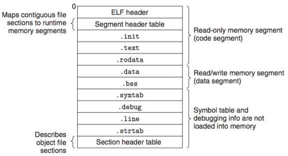
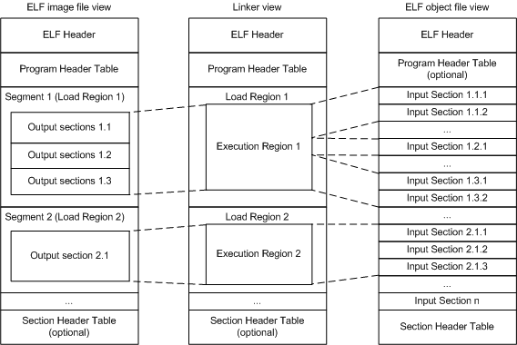

Projet dans la suite logique de nm/otools qui a pour principe de modifier les headers d'un fichier de type ELF64. Le but ici est de pouvoir ajouter un morceau de code et obfuscer une partie d'un fichier non strippé. 
 
More informations about ELF  
 
